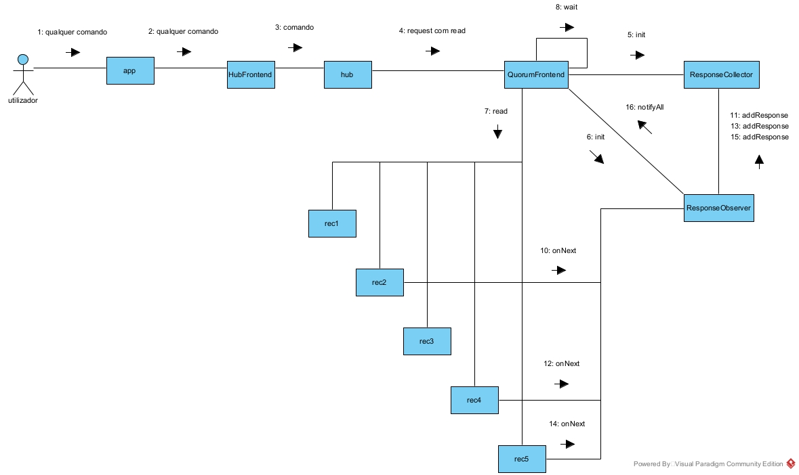
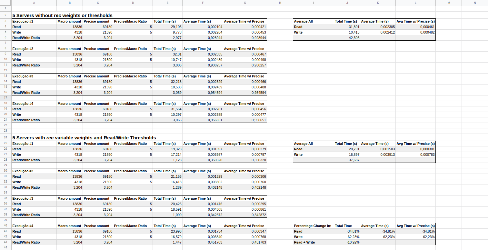

# Relatório do projeto *Bicloin*

Sistemas Distribuídos 2020-2021, segundo semestre

## Autores

**Grupo A22**

| Número | Nome              | Utilizador                                     | Correio eletrónico                             |
| -------|-------------------|------------------------------------------------| -----------------------------------------------|
| 93721  | Hélio Borges      | <https://git.rnl.tecnico.ulisboa.pt/ist193721> | <mailto:helio.borges@tecnico.ulisboa.pt>       |
| 93918  | João Gonçalves    | <https://git.rnl.tecnico.ulisboa.pt/ist193918> | <mailto:joao.p.goncalves@tecnico.ulisboa.pt>   |
| 92555  | Rui Ferreira      | <https://git.rnl.tecnico.ulisboa.pt/ist192555> | <mailto:ruibarriosferreira@tecnico.ulisboa.pt> |

  

## Melhorias da primeira parte

- [Testes do Rec agora não afetam os testes do Hub, quando estes são executados de forma seguida](https://git.rnl.tecnico.ulisboa.pt/SD-20-21-2/A22-Bicloin/commit/f7d9bd94ae22f03311420caaaadc93db4515959c)
- [O comando 'scan' sem argumentos ou um "whitespace" sozinho já não fecham a aplicação](https://git.rnl.tecnico.ulisboa.pt/SD-20-21-2/A22-Bicloin/commit/d70cd617031dd96ff041edd7f9451f35f47fc65c)

## Modelo de faltas

* Sistema assíncrono
* Clientes/Servidores
    * Considera-se N réplicas *rec*, cada uma com um peso designado, e com um peso total igual a N.
    * Possui *threshold* de escrita equivalente a 90% de N, e *threshold* de leitura equivalente a 20% de N.
    * Tolera faltas por paragem (crash) de réplicas até peso abaixo ou igual a `N / 2`
    * Não tolera escritas concorrentes de múltiplas instâncias de *hub*/*app*

## Solução

Para o programa conseguir tolerar faltas no servidor de registos durante a execução, é necessário ter várias réplicas do servidor de registos. Assim uma falha numa das réplicas pode ser ignorada enquanto houver ainda outras réplicas a funcionar.
No exemplo da figura, os *rec1* e *rec3* não responderam ao pedido de read do QuorumFrontend, no entanto devido às outras réplicas, ainda é possível completar a operação.
Também é importante mencionar que mesmo que dois dos *rec* que neste caso responderam tivessem a informação outdated o QuorumFrontend devolvia mesmo assim a informação correta que tivesse recebido do outro *rec*.

## Protocolo de replicação

**Protocolo Registo Coerente**

Este protocolo consiste na escrita/leitura de registo de forma assíncrona através de sistemas de quóruns, ou seja, subconjuntos de réplicas tais que qualquer combinação de subconjuntos diferentes possuem, na sua interseção, pelo menos uma réplica em comum.
Este comportamento é obtido através do uso de *tags* para diferenciar as respostas, bem como uma sincronização do tipo *wait-notifyAll* (ou seja, o responsável por chamar os métodos fica à espera de (N / 2) + 1 respostas), e temos então a garantia de que o valor retornado após, por exemplo, uma leitura, será sempre o mais atualizado.

Através do teorema CAP, este protocolo consegue então garantir:
* Coerência forte, visto as leituras sempre receberem o valor mais atualizado possível;
* Alta disponibilidade, pois várias réplicas podem parar de funcionar antes do programa na sua totalidade dar erro (mais especificamente, como dito acima, tolera faltas até peso total abaixo ou igual a N / 2, a partir do qual o sistema dá erro).

A leitura dos registos procede da seguinte forma:
* O cliente (no nosso caso, a instância do *hub*) envia um pedido *ReadRequest* a todas a réplicas disponíveis;
* Fica a aguardar por (N / 2) + 1 *ReadResponse* das réplicas;
* Cada réplica, ao receber o *ReadRequest*, responde com o valor pretendido bem com a tag associada ao valor;
* Da lista de *ReadResponse* recebida pelo cliente, este procura o valor associado à maior tag;
* O cliente retorna então o valor associado à maior tag.

No caso da escrita de registo, esta procede da seguinte forma:
* O cliente (no nosso caso, a instância do *hub*) executa uma leitura (com os exatos mesmos passos explicados acima), mas com o objetivo de obter a maior tag disponível, e não o valor associado a esta;
* Após incrementar a tag em 1, envia um pedido *WriteRequest*, com o novo valor de tag associado, a todas as réplicas disponíveis;
* Fica a aguardar por (N / 2) + 1 *WriteResponse* das réplicas;
* Cada réplica, ao receber o *WriteRequest*, escreve o novo valor do registo (e a nova tag associada) se e somente se a nova tag for maior que a tag já existente;
* Caso tal seja possível, responde ao cliente com *WriteResponse*
* O cliente retoma então a sua normal execução.

## Medições de desempenho

Esta tabela representa os valores de desempenho obtidos na execução de um ficheiro `demo/loopCommands.txt`. 
Caso deseje, no ficheiro `demo/README.md` está o procedimento de como testar e obter as métricas de performance.

Esta lista de comandos `demo/loopCommands.txt` começa com a execução igual à do ficheiro `demo/commands.txt`, e prossegue depois em múltiplos *loops* de execução de todos os comandos que efetuam *reads* e *writes*, ou seja:

* balance (Executa somente uma operação de *read*)
* top-up (Executa um *read* e um *write*)
* bike-up (Executa quatro *reads* e quatro *writes*)
* bike-down (Executa quatro *reads* e quatro *writes*)
* info (Executa três *reads*)

**NOTA:** Os detalhes do número de operação entre parênteses em cada comando é sobre o número "macroscópico" de operações. Ou seja, se um comando executar um *read*, na realidade está a ser executado N *reads*, e se executar um *write*, este realizada na realidade N *reads* e N *writes*

Verifica-se então que a execução tende a executar, aproximadamente, três vezes mais operações de *read* do que *writes*, e verifica-se também que este mesmo rácio se verifica no tempo de execução total das operações. 
Foi então neste rácio que a nossa otimização se foca. O objetivo será equilibrar o tempo que cada tipo de operação demora, ou seja, considerando que há, aproximadamente, três vezes mais leituras do que escritas, vamos otimizar a execução das leituras (a custo da execução de escritas) até que ambas demorem um tempo total semelhante.

## Opções de implementação

**Pesos variáveis no quóruns**

O uso de "pesos variáveis" consiste em atribuir um peso a cada réplica com o objetivo de haver algum nível de diferenciação entre quais são as de maior relevância para o bom funcionamento do sistema e as de menor relevância.
Estes pesos permitem então, por exemplo, aceitar respostas de qualquer um subconjunto de réplicas desde que o peso seja superior a `(Peso total das réplicas) / 2`.

Na nossa implementação, o peso total das réplicas é somente o número total destas mesmas, e o peso fica distríbuido consoante o tempo de resposta a um *PingRequest* efetuado na inicialização da instância *QuorumFrontend*. As réplicas com melhor tempo de resposta são então atribuídas maior peso, enquanto as outras têm menor peso.

Como caso de exemplo, se sete réplicas estiverem em execução:
* Considera-se metade do peso, ou seja, `7 / 2 = 3.5`, que arredondado "para baixo", obtém o valor `3` como "base";
  * Em caso de um número par de réplicas, subtrai-se 1 da metade do peso total para se obter o valor "base";
* Este valor base `3` é então o peso da réplica com tempo de resposta mais elevado;
* Com este mesmo valor base, as **três** próximas respostas têm peso `1`;
  * Em caso de um número par de réplicas, uma réplica extra terá também peso `1`;
* As últimas réplicas terão peso igual a `peso que resta / valor base`, ou seja, ficam com peso igual a um terço;
  

**Nota:** Para número de réplicas ativas menor ou igual a quatro, todas ficam com peso igual a `1`.

Em questão de resultados, esta é uma ótimização sem resultados aparentes num contexto de testes locais, pois todas as réplicas estão a correr no mesmo sistema. Desta forma, mais sentido se todas as réplicas tivessem o mesmo peso. Mas esta otimização, em contexto de sistemas distribuídos por vários sistemas, traz vantagens pois serão as réplicas mais rápidas/próximas que terão maior relevância depois na receção de respostas.

**Quóruns de Leitura e Escrita**

Esta otimização consiste em estabelecer pesos distintos para cada tipo de operação, de modo a otimizar uma especifica operação, à custa da outra.
Estes pesos distintos, também chamados de *Write Threshold (WT)* e *Read Threshold (RT)*, têm de assegurar dois fatores de modo a ainda garantir a coerência do sistema:
* `RT + WT > Peso total do sistema` (que no nosso caso é igual ao número total de réplicas ativas), de modo a que os quóruns de leitura e escrita ainda tenham uma réplica em comum;
* `WT > Peso total do sistema / 2`, de modo a que quóruns de leitura também ainda tenham pelo menos uma réplica em comun.

Na nossa implementação, como o objetivo é otimizar as leituras, temos então de ter um WT muito maior que RT, isto pois, com um RT baixo, será necessário quóruns mais pequenos para o cliente/*hub* continuar a sua normal execução.
Decidimos ter WT = 90% do peso total, e RT = 20% do peso total, totalizando em 110% do peso, que garante ambos fatores acima referidos.

Como então visível na tabela de resultados, esta otimização permitiu que as leituras sejam efetuadas aproximadamente 34% mais depresa, ao custo das escritas demorar agora mais 62% do tempo para se executarem.
No total temos uma melhoria no tempo de execução de aproximadamente 10% (embora, considerando o pequeno *pool* de resultados, pode ser na realidade uma melhoria desprezável), e verifica-se também que o rácio no tempo de execução entre ambas operações está agora mais perto de 1, ou seja têm agora um tempo de execução mais equilibrado.